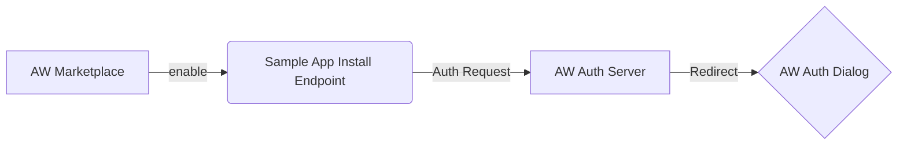
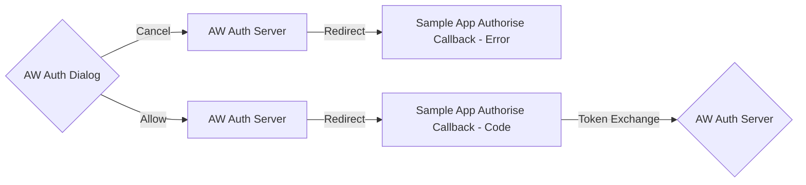
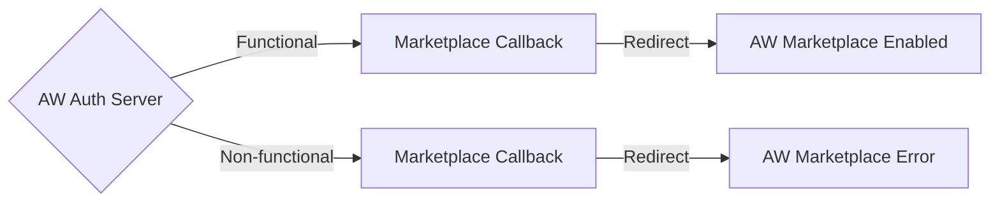

# AgriWebb Marketplace Sample App

## Table of Contents

- [Introduction](#introduction)

- [Architecture](#architecture)

- - [Install Endpoint](#install-endpoint)
  - [State Manager](#state-manager)
  - [Callback Endpoint](#callback-endpoint)
  - [Token Exchange](#token-exchange)

## Introduction

The AgriWebb Marketplace supports the [OAuth 2.0 Authorisation Grant Flow](https://datatracker.ietf.org/doc/html/rfc6749#section-4.1); this sample app demonstrates how a server-side rendered application can integrate with the AgriWebb Marketplace. You can try out this sample app at the following link [marketplace-sample-app.playground.agriwebb.io](https://marketplace-sample-app.playground.agriwebb.io/). This app will go through the integration process and displays a list of allowed farms after you have completed the integration. To learn more, please see the [AgriWebb API Documentation](https://docs.staging.agriwebb.io/).

## Architecture

This sample app is a serverless project built on AWS Lambda and DynamoDB. The app is structured into three main folders, [oauth2](./src/oauth2), [server](./src/server), and [views](./src/views). The [oauth2](./src/oauth2) folder contains all the related authorisation logic, the [server](./src/server) folder contains the corresponding application code, and the [views](./src/views) folder contains the rendered HTML. The [oauth2](./src/oauth2) folder sans a few lines of user-related code is a normative reference for implementing an [OAuth 2.0 Authorisation Grant](https://datatracker.ietf.org/doc/html/rfc6749#section-4.1) client. This code has four main components: the [install endpoint](./src/oauth2/handle-install.ts), [state manager](./src/oauth2/state-manager.ts), [callback endpoint](./src/oauth2/handle-callback.ts), and [token exchange](./src/oauth2/token-exchange.ts).

### Flow Charts

#### AgriWebb Marketplace to Auth Dialog

#### AgriWebb Auth Dialog to Auth Server

#### AgriWebb Auth Server to Marketplace

### Install Endpoint

The [install endpoint](./src/oauth2/handle-install.ts) begins the [OAuth 2.0 Authorisation Grant](https://datatracker.ietf.org/doc/html/rfc6749#section-4.1), where the sample app (OAuth 2.0 Client) creates an authorisation request to the AgriWebb auth server (OAuth 2.0 Authorisation Server). The install endpoint redirects the users' browser to the /authorize route with the required parameters appended. Our implementation requires that if you receive a parameter called organization, you must pass it through to the AgriWebb auth server; this prevents the user from having to re-input their organisation.

### State Manager

The [state manager](./src/oauth2/state-manager.ts) is a collection of utility functions for working with the state parameter, which is vital for preventing Cross-Site Request Forgery (CSRF). It must be non-guessable and stored in a location accessible only to the client and the user-agent (i.e., protected by same-origin policy). The [state manager's](./src/oauth2/state-manager.ts) implementation generates a cryptographically random state parameter and an HMAC-SHA256 signature. It utilizes an expiring "same-site" cookie to store the state's signature for verification on the [callback endpoint](./src/oauth2/handle-callback.ts).

### Callback Endpoint

The [callback endpoint](./src/oauth2/handle-callback.ts) is where the sample app (OAuth 2.0 Client) receives the response associated with the authorisation request it made from the [install endpoint](./src/oauth2/handle-install.ts). This response will be one of two responses; an error response containing an error parameter and optionally an error_description and error_uri, or the authorisation code, which is exchangeable for credentials by performing a [token exchange](./src/oauth2/token-exchange.ts). The callback endpoint must verify the state parameter.

### Token Exchange

The [token exchange](./src/oauth2/token-exchange.ts) process allows the sample app (OAuth 2.0 Client) to use different exchange processes to obtain an access_token and other related tokens. At the time of writing this, we support two token exchange types; authorization_code and refresh_token. To authenticate during the [token exchange](./src/oauth2/token-exchange.ts), you must perform [Client Authentication](https://datatracker.ietf.org/doc/html/rfc6749#section-3.2.1) using [The Basic Authorisation Scheme](https://datatracker.ietf.org/doc/html/rfc7617) with the provided client_id and client_secret as the username and password.
